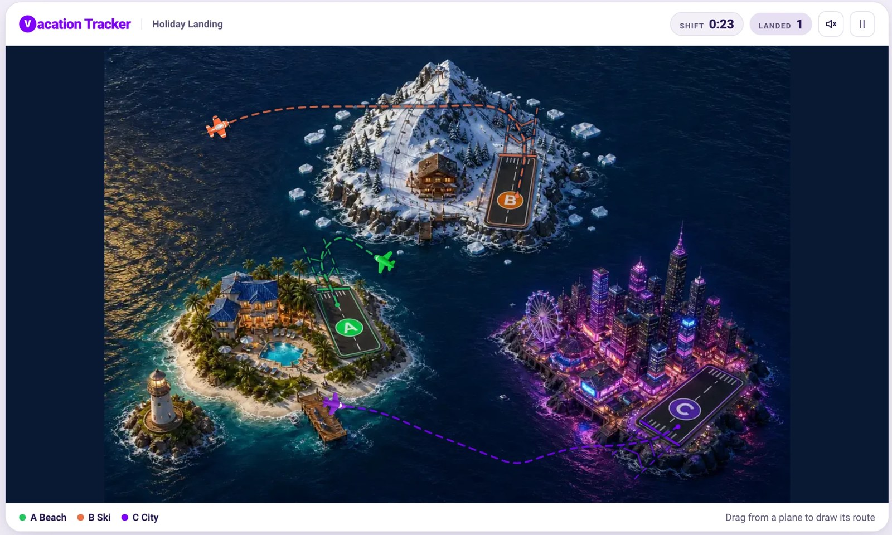

<p align="center">
  
</p>

# Holiday Landing

An air-traffic-control game in the style of Firemint's *Flight Control*. Planes
arrive from the edges of the map, you drag each one a route with the mouse or a
finger, and every plane has to land on the runway painted its colour. Send one to
the wrong island, or let two touch in the air, and the shift is over.

It was built as a giveaway for [Vacation Tracker](https://vacationtracker.io) —
three islands, three kinds of time off — and it is yours to take apart and
re-skin. See [Make it your own](#make-it-your-own).

**The whole game is one HTML file.** `dist/holiday-landing.html` is ~242 KB with
every image embedded as a data URI. No build step, no bundler, no CDN, no
network requests, no cookies, no storage. Double-click it and it plays. Email it,
drop it on any static host, put it behind a corporate firewall — it does not
care.

---

## How to play

1. **Drag from a plane** to draw its route. It starts flying the line
   immediately, while you are still drawing.
2. **Finish the line straight down the runway.** A plane only lands on a clean
   approach — within 26° of the runway heading. Cross at the wrong angle and it
   flies over, and you go around.
3. **Colours must match.** Green lands at A, orange at B, purple at C. The wrong
   island ends the run, and so does letting two planes touch.

A red halo and a dashed link warn you before any collision. The shift gets
harder once a minute for the first four minutes, then holds at full pressure.

`Space` starts and restarts · `P` pauses · `M` toggles sound.

## Run it

Nothing to install if you just want to play:

```bash
git clone https://github.com/lavcrnobrnja/vacation-landing.git
open vacation-landing/dist/holiday-landing.html
```

To rebuild from source:

```bash
npm install
python3 tools/prep_assets.py   # artwork      -> assets/
node tools/make-og.js          # link preview -> dist/holiday-landing-og.jpg
node tools/build.js            # art + code   -> dist/ and docs/
npx playwright test            # 41 tests
```

The asset step needs Python with `pillow`, `numpy` and `scipy`.

## What's in here

| Path | |
|---|---|
| `dist/holiday-landing.html` | **the game** — self-contained, open it directly |
| `src/game.html` | the source: markup, CSS and JS, art by placeholder |
| `assets-src/` | original artwork as supplied |
| `assets/` | keyed, trimmed, compressed art that gets embedded |
| `tools/prep_assets.py` | turns `assets-src/` into `assets/` |
| `tools/build.js` | inlines the art as data URIs, writes `dist/` and `docs/` |
| `tools/make-og.js` | renders the 1200×630 link-preview image |
| `tools/dbg/` | measuring tools used to tune the game (see below) |
| `tools/shots.js` | regenerates the screenshots in `shots/` |
| `tests/` | 41 Playwright tests |
| `docs/` | what GitHub Pages serves |
| `RUNWAYS.md` | the runway geometry, and how it was measured |

---

## Make it your own

Everything specific to Vacation Tracker sits in a handful of places. A re-skin is
mostly new artwork plus four numbers.

### 1. Swap the artwork

Drop your own files in `assets-src/` and run `python3 tools/prep_assets.py`.
PNG, WebP and JPEG all work.

| File | What it needs to be |
|---|---|
| `map-src.*` | the playfield, **3:2**, with the runways painted on it |
| `plane-a-src.*` | a sprite for destination A, **top-down and nose-up** |
| `plane-b-src.*`, `plane-c-src.*` | the same for B and C |

The prep script trims each sprite to its alpha bounding box, scales it so the
longest side is 144px, and re-encodes the map to WebP. Tune with `PLANE_LONGEST`
in the script, or `MAP_WIDTH=1200 MAP_QUALITY=76 python3 tools/prep_assets.py`
for a sharper map at a larger file size.

**If your sprites have no alpha channel,** the script handles it. Ours arrived
with transparency faked as a light-grey checkerboard, which composites as a
white box on dark water. It is keyed out by *connectivity* — flood-filling the
near-white background inward from the border — rather than by whiteness, because
one of our planes has white fuselage stripes and a grey propeller that a
whiteness key destroys. The object mask is then eroded 2px to drop the blend
band at the edge, and downscaled in premultiplied space so no white halo is
reintroduced. `assets/verify/` holds the before-and-after renders.

### 2. Move the runways

Runways are stored in `src/game.html` as the **four corners of the painted
tarmac**, in the order near-left, far-left, far-right, near-right, where "near"
is the threshold a plane crosses on approach:

```js
const RUNWAYS=[
  {k:'A',name:'the beach',col:'#22C55E',
   quad:[[398,455],[438,580],[520,569],[457,453]]},
  ...
];
```

Everything else — the threshold, the heading, the approach corridor, and a
landing box that narrows along the runway's length — is derived from those four
points at load. Coordinates are in a fixed 1280×853 logical space, scaled to the
display in CSS only.

To find the corners for your own map, render it under a labelled pixel grid and
read them off:

```bash
python3 tools/dbg/grid.py A                        # grid over runway A
python3 tools/dbg/grid.py A '[[398,455],...]'      # grid plus a candidate quad
```

Corners, not a rectangle, because most maps drawn in perspective have runways
whose near end is wider than the far end. [`RUNWAYS.md`](RUNWAYS.md) records the
measurements and the three automatic fits that failed before we measured by
hand — worth reading before you try to automate it.

### 3. Retune the difficulty

One tier per elapsed minute, in `src/game.html`:

```js
const TIERS=[
  {cap:3,  gap:6.2, speed:38},   // 0:00 — learn the game
  {cap:5,  gap:4.9, speed:46},   // 1:00
  {cap:7,  gap:3.9, speed:54},   // 2:00
  {cap:9,  gap:3.0, speed:61},   // 3:00
  {cap:11, gap:2.3, speed:68}    // 4:00+ — full pressure
];
```

`cap` is how many planes may be airborne at once, `gap` is seconds between
arrivals, `speed` is px/s. Add or remove rows to change how long the ramp takes;
the last row is what the game holds at. The cap is by far the strongest lever.

### 4. Rebrand

- **Palette** — the `:root` custom properties at the top of `src/game.html`.
  `--purple`, `--orange` and `--green` are also the three plane colours, mirrored
  in `TYPES` and in the footer legend.
- **Wordmark** — reproduced in CSS (`.brand` / `.mark`), not an image file.
- **Copy** — the start card is built in `showStart()`; destination names live in
  `NAMES` and the colour words in `COLW`.
- **Link preview** — edit `DESC` in `tools/build.js` and the layout in
  `tools/make-og.js`.

### 5. Change the number of destinations

Three is not baked into the engine, but it is not a single constant either.
Adding a fourth means touching six places in `src/game.html`: `TYPES`,
`RUNWAYS`, the arrival bag in `refillBag()`, `NAMES`, `COLW`, and the footer
legend markup — plus a `chip()` call on the start card. Everything else, from
the corridors to the landing maths, is derived.

### Publishing it

`node tools/build.js` writes `docs/`, which GitHub Pages serves directly:
**Settings → Pages → Deploy from a branch → your branch, `/docs`**. The page
carries Open Graph tags and a preview image, so the link unfurls with the game's
title and artwork.

Any static host works the same way — `docs/index.html` and
`docs/holiday-landing-og.jpg` are self-contained and portable. `og:image` is a
relative path so the file holds no absolute URLs; make it absolute if a
particular unfurler needs that.

---

## How it works

A few decisions that are less obvious than they look.

**Steering.** Planes follow the drawn line by *pure pursuit* — chasing a point a
fixed distance ahead on the path, never a waypoint — over a path that is
resampled to 12px, averaged once with a 5-tap mean, and rounded with two Chaikin
passes. The closest-point search only ever runs forward from a cached index, so
a plane can never latch onto a segment it has already flown and thrash.

Turning is defined by a fixed **radius** (20px), not a fixed rate. A fixed rate
means the turn radius grows with speed, and a plane that tracked its line at
38px/s runs 24px wide of it at 68px/s. Against a fast mouse flick — sparse
pointer samples, hard corners — that change took the worst deviation from 24px
to 7.5px and the average from 9.7px to 1.9px, identically at every speed.

The route is rebuilt on every pointer move and handed straight to the plane, so
it flies your line while you are still drawing it rather than waiting for the
mouse to come up.

**Arrivals.** Plane colours come from a shuffled bag holding two of each, not an
independent roll per arrival. A uniform roll produces a run of four or more in
*every* 300-arrival session and a run of six or more in about half of them. The
bag keeps the mix even, a hard cap refuses a fourth of the same colour, and a
nudge toward whatever the sky holds least of stops one runway getting swamped —
while still letting about one arrival in five repeat, because a sequence that
never repeats reads as mechanical.

**Layout.** The canvas sizes itself from its own intrinsic aspect ratio rather
than being given one by a wrapper, which is what keeps the map from stretching.
The portrait "turn your phone" gate requires `pointer:coarse`, so a narrow
desktop window or an embedded side panel still gets a playable game. Cards
compact at narrow widths and short heights so the buttons stay reachable.

**Everything else.** WebAudio oscillators only, muted by default. Reduced motion
is respected. Full keyboard control, `aria-label` on the canvas, auto-pause when
the tab is hidden. No storage APIs anywhere.

## Testing

```bash
npx playwright test
```

41 tests: layout ratios across viewports, approach guides staying on canvas,
the rules (correct landing, wrong island, warning before crash, un-routed
flyover, crossing at 90°), the difficulty tiers, arrival distribution, and the
end-to-end player loop — sweep a curve across the map, finish it down the
runway, land.

Two are worth knowing about. The **zig-zag regression test** counts sign changes
of the heading rate two ways, raw and low-passed, and the suite proves the metric
can fail by feeding it a synthetic waypoint-chaser trace, which scores 129
against a clean arc's 1. The **live-drag test** steps simulation time *between*
pointer moves, which is what makes it different from every other drag test.

`playwright.config.js` points at the Chromium bundled in this container; change
`launchOptions.executablePath` to run it elsewhere.

## Licence

Code is MIT — see [LICENSE](LICENSE). Do what you like with it.

**The artwork is not.** The map, the three plane sprites and the Vacation Tracker
name and logo belong to Vacation Tracker. If you fork this, bring your own art
and your own branding — [Make it your own](#make-it-your-own) is written for
exactly that, and the game works fine with anything in the right shape.
